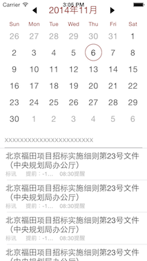
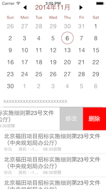

HZCalendar
==========
Previews
----------
###主界面

###列表

###其他

功能
------
+多功能日历
+添加提醒
+编辑提醒
+删除提醒

Usage
---
Check out the [demo app](https://github.com/khzliu/HZCalender/archive/master.zip) for an example.

Requirements
---
- iOS 7 or higher.
- Automatic Reference Counting (ARC).

License
---
ZLSwipeableView is available under MIT license. See the LICENSE file for more info.
